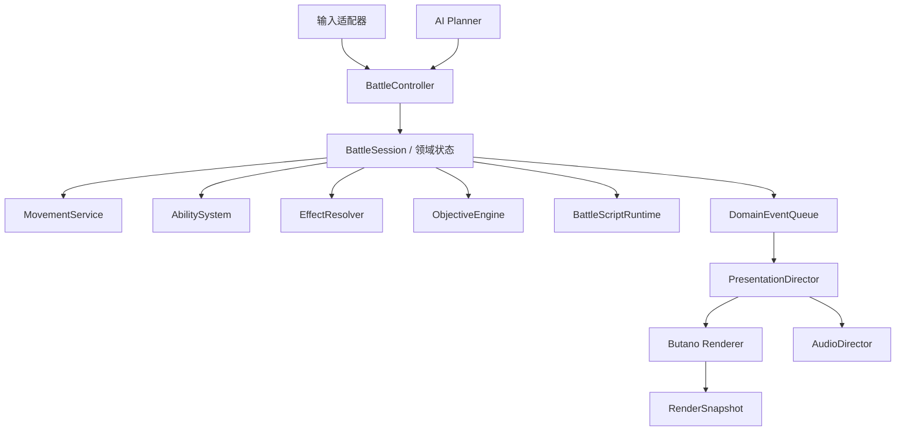
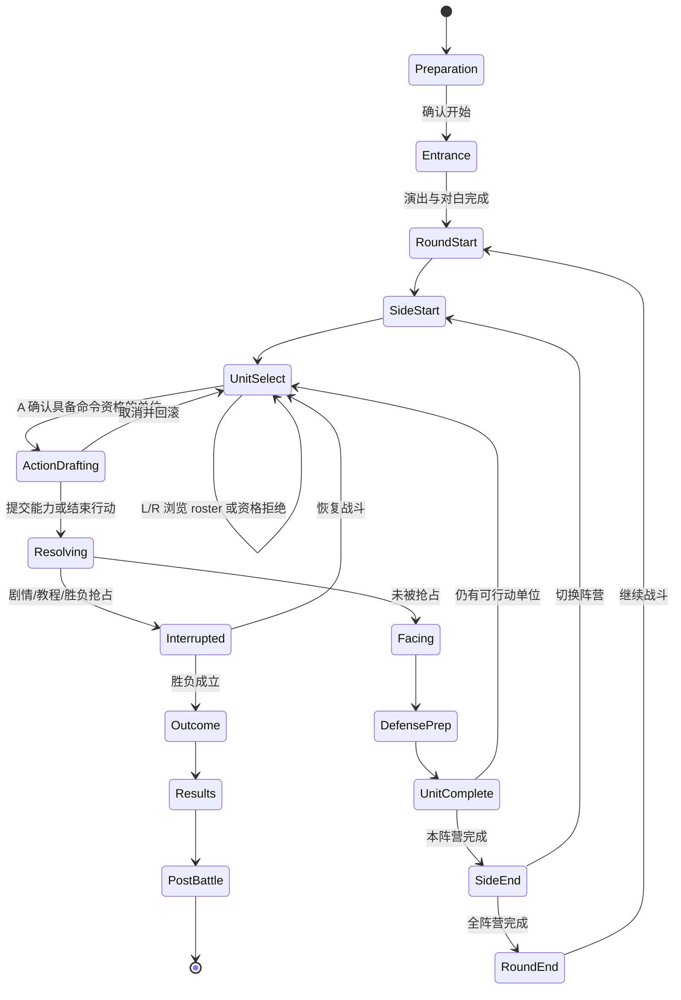

# Butano《木叶战记》战斗系统架构设计

日期：2026-07-22（2026-07-23 纠错）
状态：**旧截图实现已被用户否决；证据驱动的动作/角色/状态领域切片已开始落地，完整通用架构仍未完成，不得以 scenario 41 单关通过宣称功能等价**

## 0. 纠错声明与实施门槛

2026-07-23 的复核确认：此前 Butano scenario 41 把原 ROM 截图、固定选项和单条黄金路线拼接成可运行演示，并没有建立能生成这些画面与结果的完整战斗规则。该原型不再是迁移基线，也不算本设计的部分实现。它只保留为画面、音频和输入时序对照；交互战斗不得显示预制整屏截图或按固定路线伪造领域结果。

## 领域实现状态（2026-07-23）

当前首个实现闭环已经替换旧固定伤害路径，但仍只是本设计的领域基础：

- `generate_butano_battle_action_content.py` 把 ROM 绑定的 87+94 条主动动作/忍具生成到
  `ActionDefinition` 固定表，成本、表现、效果、目标、范围和升级保持正交；
- `generate_butano_battle_unit_content.py` 把 63×(15+24) 个角色主动/被动槽及基础数值生成到
  `UnitDefinition`，scenario 41 从角色 1/30 实例化，不再手填 80 伤害或敌方 HP；
- 玩家与 AI 共用 `battle_action_resolver` 的资格、预览、逐 hit、成本和原子提交；scenario 41
  的敌方已从角色 30 的六动作列表逐项预览，并基于可达格选择合法最优动作真实伤害玩家；
- 每单位状态改为固定 16 个活动槽与 16 个 removed-event 槽，已实现低 6 位查找、替换、移除、
  side-end tick 和写轮眼首有效 hit 截断。
- 活动战斗阶段已停止加载整屏 combat layer，改为无单位地图、独立单位/游标 sprite 和领域快照
  生成的 HP/菜单；2580 帧 mGBA 路线证明移动、选术、选目标、伤害、退场和战后可连续运行。

尚未接入的 handler、完整 AI utility、多目标范围、复合 objective、召唤生命周期仍按本文后续
章节推进。不可交互的必杀动画、教程/结算参考帧暂留在表现层且不再拥有领域写权限；它们不计入
交互战斗架构完成度。

本设计必须在以下证据门槛全部通过并经用户重新审阅后，才能进入 Butano 重写：

1. 63 条单位模板及其角色/敌人/变体身份、成长和可用动作槽完成可追溯建模；
2. 87 条角色主动动作及其同 ID 数值模板、45 条被动/训练效果和 94 条忍具动作被正确分库，名称、成本、目标、数值、升级与效果关联不再靠猜测；
3. 单位选择、移动、施术、补充查克拉、休息、待机、面向、防御准备、敌方阶段、打断、胜负与结算的完整回合状态转换由多场原 ROM 运行证据闭合；
4. 单人、多角色、召唤、多敌 AI、护送/捕获/占位等复合目标至少各有一个可重放的原 ROM 验收样本；
5. 领域模型能仅凭关卡与内容数据产生合法行动和结果，渲染层没有写入 HP、坐标、资源、回合或胜负的通道。

## 1. 目标

在 Butano 21.7.1 上建立可承载《木叶战记》全部战斗关卡的通用领域架构。设计以在线录屏逐帧分析和 scenario 41–50 原 ROM 运行证据为输入，纠正当前 `scenario_41_battle` 的单场景硬编码模型。

本设计要求：

- 保留原作“准备 → 入口演出 → 玩家阶段 → 敌方阶段 → 胜负/结算”的可见流程；
- 支持多单位、召唤单位、移动、术/忍具、查克拉、休息、行动结束、面向和防御准备；
- 支持可组合胜负目标、剧情打断、护送/占点/捕获等非清敌任务；
- 领域逻辑与 Butano BG/OBJ、输入、音频和逐帧演出解耦；
- 在 GBA 固定内存预算下使用固定容量数据结构，避免运行时堆分配；
- 同一领域核心可被宿主 C++ 测试、Butano 场景和 mGBA 黄金路线共同驱动。

本文不把尚未逆向的数值写成猜测常量，但角色、动作、被动、忍具、AI 与关卡数据的**完整字段模型、引用关系和证据等级**是设计验收范围，不能再推迟到实现后补齐。设计不要求照搬原 ROM 的 WRAM 地址或 Thumb 控制流，但每项用户可见规则必须能回链到 ROM、运行时录像/快照或相互印证的攻略证据。

## 2. 证据优先级

1. 原 ROM 的受控输入、checkpoint、内存字段和逐帧 trace；
2. 原版日文录屏的可见顺序；
3. 中文补丁录屏的控制流程；
4. 文字攻略对菜单语义的补充；
5. 当前 Butano 实现仅作为反例和可复用局部资产，不作为规则权威。

逐帧证据、来源哈希和观察窗口见 `notes/butano-battle-video-frame-analysis-20260722.md`。

## 3. 方案比较

### 方案 A：继续扩展单体有限状态机

把更多 `battle_phase`、关卡条件和技能分支继续加入 `scenario_41_battle`。优点是短期改动少；缺点是回合、单位行动、演出、输入和关卡脚本继续耦合，每增加技能或目标都会扩大 switch，无法可靠处理剧情抢占、取消回滚和多单位行动。此方案不采用。

### 方案 B：分层状态机 + 事务式行动 + 数据驱动规则（采用）

根状态机只管理战斗生命周期和阵营阶段；单位行动使用独立子状态机；技能、效果、目标和胜负条件由数据驱动；所有可见演出进入阻塞式演出队列。它既能表达原作流程，又能用固定数组和显式命令适应 GBA，测试边界清晰。

### 方案 C：完整 ECS + 事件溯源

单位、效果、动画全部建成 entity/component/system，并保存完整事件日志。扩展性最高，但会带来运行时索引、内存、调试和序列化成本；原作单位规模和规则复杂度不需要完整 ECS。设计仅采用轻量实体 ID 和领域事件，不采用完整 ECS/事件溯源。

## 4. 总体分层



依赖方向固定为“适配器 → 领域 → 事件 → 表现”。渲染器、音频和 Lua/mGBA 验收不得直接修改领域状态。

## 5. 核心运行时模型

### 5.1 BattleScenarioDefinition

只读关卡定义，构建期生成：

- 地图、地形、阻挡和初始相机；
- 参战单位、阵营、部署规则和可控性；
- 胜利/失败目标表达式及优先级；
- 教程限制、剧情触发器、入口/战中/战后脚本；
- BGM、场景资源和关卡专用规则参数。

关卡差异进入定义或小型规则插件，不复制战斗控制器。

### 5.2 BattleSession

唯一可变领域聚合，包含：

- `round_index`、当前 `side_phase` 和生命周期状态；
- 固定容量 `UnitInstance` 集合和占位索引；
- 当前 `UnitActionState` 与可选 `ActionDraft`；
- 查克拉、忍具库存、状态效果、召唤关系和 RNG 状态；
- 目标进度、剧情变量、结果与奖励草案；
- 固定容量领域事件队列。

`BattleSession` 不包含 BG、sprite、文本对象、音频 handle 或按键状态。

### 5.3 UnitInstance 与行动账本

每个单位至少保存：

- 稳定 `UnitId`、角色模板 ID、阵营、控制方式；
- 当前格、面向、HP、查克拉、状态、库存引用；
- 本回合 `ActionLedger`：是否可行动、是否移动、是否使用主动能力、是否结束、已准备的防御；
- 召唤者、生命周期和 AI 标签；
- 动画/外观只保存逻辑姿态枚举，不保存 Butano 对象。

影分身是正常 `UnitInstance`，通过召唤关系和受限能力集表达，不用特殊全局变量。

## 6. 分层状态机（候选模型与 ROM 锚点）

下图是待验证的领域归一化模型，不是对原 ROM 控制流已经完成的命名。原 ROM
`0x080732B4` 已静态闭合 36 个分派值；当前只允许把有地址和运行时证据的锚点映射到
领域阶段：`0x1300` 阵营/资格扫描、`0x2000` 玩家单位选择、`0x1020` 当前单位激活、
`0x3000` 初始行动菜单、`0x3110` 移动选择、`0x4000` 移动后行动菜单、
`0x4100` 施术目标/确认、`0x3210` 查克拉交换结果、`0x3310` 休息确认、
`0x6000` 玩家提交门、`0x7000` 敌方行动准备、
`0x9000` 面向、`0x9100` 防御准备、`0x9200` 术菜单、
`0xD000` 行动完成、`0xE010` 胜负/退出检查、`0xF000..0xF400` 结果与 postbattle。
`0x8000` 已确认同时承载战斗对白、结果弹窗和胜利演出，说明可见子流程不等于顶层状态。
其余原 ROM 状态保持 unresolved，不能因为下图存在就推断其语义。完整机器清单见
`notes/battle-controller-states-20260723.json`，18 个可见/行动边界与任务栈绑定见
`notes/battle-controller-checkpoint-bindings-20260723.json`。

单位选择层必须把 roster 游标与已确认行动单位分离。四次连续 L 输入的运行时绑定证明，
`0x2000` 内本场 L 的完整环绕顺序为鸣人 → 猫 → 小樱 → 佐助 → 鸣人；每次只转移两个实例的
`unit+0xC1` 选择标记，当前行动单位指针仍为空，战斗控制区也不提交变化。只有确认单位后
才创建 `ActionDraft` 并绑定 actor。目标代理也可以进入可选 roster：猫实例虽没有主动动作
模板，仍可成为游标目标，因此“是否出现在 roster”“是否可行动”“可用哪些命令”必须是三次
独立查询，不能用角色类型或非空技能表替代。空槽可能保留陈旧标记，任何扫描都必须先验证
实例有效性。新增 R 样本又从鸣人切到佐助，仍只转移同一选择标记且不绑定 actor，因此
L/R 的方向均已有运行时绑定，本场完整环绕也已闭合。

进一步的 battle 15 对照证明必须把浏览 roster 与命令资格分离。已行动单位仍能被 L/R 浏览，
护送/任务代理同样能成为选择目标；资格检查发生在 A 确认边界。可行动小樱的 A 把
`0x2000` 推进到 `0x3000` 并绑定 actor，而已行动佐助与护送目标的 A 都是保持 `0x2000`
的领域 no-op，单位池、战斗控制区和菜单状态块均无变化。因此 `UnitSelect` 保存的是可浏览
roster，`can_issue_commands(unit)` 才决定确认能否创建 `ActionDraft`。死亡、失能、召唤物及
跨关卡资格差异仍是实施前缺口。



`Entrance` 和 `Interrupted` 不是黑屏占位状态，而是由演出队列驱动的可见序列。目标系统可在效果结算后立即进入 `Outcome`，因此捕获最后一只猫时可以跳过面向和防御；需要“指定位置+指定面向结束行动”的目标则在 `UnitComplete` 事件后成立。

当前能从 ROM 确认的调度骨架是：阵营扫描会遍历固定 12 个战斗单位槽，依据阵营、
有效状态和单位行动字段决定进入玩家选择还是另一行动方；玩家选择随后绑定当前单位，
再进入初始行动菜单。scenario 41 的哈希绑定 checkpoint 已进一步证明：可达格移动位于
`0x3110`；移动后命令集切到 `0x4000`；术菜单位于 `0x9200`；目标选择和攻击确认共享
`0x4100` 的嵌套子控制器；行动后的面向与防御分别位于 `0x9000/0x9100`。行动尾部通过
MOVEDONE 边界进入阵营/胜负后续链。四组哈希绑定的跨关卡事务证据进一步确认：三个
取消样本均不改变单位池、忍具库存或战斗控制区；一个瞬身术提交样本只在
`0x8000 → 0x9000` 时同时写入查克拉、落点和行动标记。机读证据见
`notes/battle-action-transaction-bindings-20260723.json`。AI、其他成本类型及这些顶层
状态内部的完整转移仍在追踪，因此本节仍不能作为 Butano 实施许可。

## 7. 事务式单位行动

### 7.1 ActionDraft

玩家或 AI 选择单位后创建草案：

- 起点、预览位置和路径；
- 已选择命令、能力、目标格/目标单位；
- 预计资源成本、命中、伤害和效果摘要；
- 当前可取消层级；
- 提交后将产生的领域命令。

移动预览、技能目标和确认期间只修改草案。B 返回上一层；回到单位选择时完整丢弃草案。只有攻击/能力开始解析或确认“行动结束”时，移动、资源和效果才原子提交。

该边界不是从 UI 猜测：取消样本已证明三种返回层级只改变 modal/控制器子状态；提交样本
证明 `unit+0x07` 当前查克拉、`unit+0xC4/+0xC5` 坐标和 `unit+0xC0` 行动标记在
解析完成后一起改变。新领域模型可以采用不同内存布局，但必须保持相同的可观察事务语义。

### 7.2 命令资格查询

`CommandEligibilityService` 根据单位、账本、资源、地形和关卡限制返回：

- `available`：可选；
- `disabled(reason)`：显示但拒绝；
- `hidden(reason)`：本状态不显示。

完整命令集合是移动、术/忍具、补充查克拉、休息、行动结束。移动或施术后菜单自然缩减，不在 UI 中写死场景特例。

### 7.3 提交边界

- 选择目的格：仍可撤销；
- 打开能力列表/移动目标：仍可撤销；
- 最终“可以吗？”之前：仍可撤销；
- 能力成本扣除和效果队列建立：不可撤销；
- 行动结束确认：提交移动并进入尾部；
- 剧情/胜负抢占：清理草案，按脚本指定是否标记行动完成。

查克拉命令是 HP 与查克拉之间的领域事务，而不是 UI 直接改数值。已绑定样本在
`0x3000 → 0x3210` 一次提交 HP `134→119` 与查克拉 `4→5`，忍具库存不变。
休息会结束当前单位行动：已绑定样本在 `0x3310 → 0x1220` 提交 HP `24→41`、保持
查克拉不变，并把低位行动标记从 `0→32`。实现必须把两者建成领域命令并由同一事务层提交；
具体成本/恢复量来自内容与角色规则，前两个恢复类样本不授权使用固定 15/17 常量或推导通用公式。

忍具必须把持久装备/背包与战斗内可用槽位分层建模。已绑定的十字手里剑样本在
`0x4100 → 0x9000` 提交时，把行动单位首个装备槽 `unit+0xB1` 从 `1→0`，但持久忍具
库存区、HP 和查克拉均不变。`BattleSession` 因此从持久 loadout 初始化每个
`UnitInstance` 的本场可用忍具；行动提交只消耗实例槽位，跨战斗持久化由战后/装备领域
另行负责。当前证据只闭合首槽和一次消耗，不允许推测 `unit+0xB0`、其余槽位数量或堆叠格式。

## 8. 移动与地图

`MovementService` 负责：

- 32×16 逻辑格与地图 tile 的映射；
- 地形成本、阻挡、单位占位和临时占位；
- 可达范围、最短合法路径和目的格验证；
- 移动能力/瞬身等非普通路径；
- 为 AI 和玩家返回相同的查询结果。

占位更新只发生在行动提交。AI 规划可建立只读模拟占位，不能先改真实地图。地图服务不判断胜负；移动提交事件交给目标系统处理。

## 9. 能力、忍具与效果

### 9.1 AbilityDefinition

统一描述术、体术、忍具和特殊行动。ROM 证据已经否定“一个技能枚举同时决定成本、目标和
效果”的模型：运行时 `+0`、`+2`、`+3` 分别承载三种互不依赖的轴。因此核心必须拆成
`CostPolicy`、`EffectDescriptor`、`TargetPolicy` 三个正交策略，并另外组合
`RangeShape` 与 `UpgradeRule`：

- `CostPolicy`：none/current-chakra/current-HP/no-scalar-special/battle-local-tool-slot，并提供
  `can_pay`、`stage`、`commit`；取消和预览只能调用前两者；
- `EffectDescriptor`：稳定的低 6 位 effect code、flags 与参数，交给数据驱动 resolver registry；
- `TargetPolicy`：自己/隐式行动者、两种友军资格、敌军、任意占用单位、空格；资格查询不读取
  动画族或效果中文名；
- `RangeShape`：距离、直线 flags、范围/形状 flags 和视线规则；
- `UpgradeRule`：选择 potency/hit/success/distance/range/duration 中的一个成长目标，并在构建
  runtime descriptor 时应用；
- 资格：角色、状态、已执行动作及上述成本/目标策略的组合结果；
- 预览：预计命中、伤害、治疗、位移和状态；
- `EffectSequence`：由 resolver handler 产出的伤害、治疗、召唤、移动、替身、状态、捕获、
  脚本事件等节点，不由菜单页面预先写死；
- `PresentationBinding`：单独保存显示/动画族、timeline 和音频 cue ID，不能参与领域结果判断。

主动动作模板直接复制为 runtime descriptor；忍具模板则先固定 `CostPolicy` 为战斗内忍具槽，
把源 `+0` 移到显示/动画族并复制 `+2..+9`。两者随后必须走同一套目标资格、事件构建和
resolver。`0x08076F44` 的 63 项跳转表在新实现中对应固定容量的数据驱动 resolver registry；
已命名 handler 可注册强类型实现，尚未命名项保留数值 ID 并在内容生成期拒绝进入可玩关卡，
不得回退为截图、动作名 switch 或关卡专用结果。

忍具引用由持久 `NinjaToolLoadout` 和战斗内 `EquippedToolSlot` 两层组成：前者描述角色进入
战斗时携带什么，后者描述本场仍可使用什么并参加命令资格查询。能力定义引用忍具动作模板，
但不能直接写持久背包；事务层只有在最终确认后才清除/扣减对应的战斗内槽位。

### 9.2 EffectResolver

`EffectResolver` 必须显式区分预览、最终确认和解析。battle 15 的哈希绑定已经证明，两条
攻击都从 `0x4100` 进入同一个 `0x8000` 后才改变 HP、成本和行动账本；普通分支写入伤害且
不移动目标，替身分支保留目标 HP、提交施术成本并移动目标。因此替身是共享 resolver 内的反应分支，
不能把预计伤害直接写入目标 HP，也不能在演出代码中补做位移。已绑定替身样本的目标
`unit+0x154` 在确认/解析三态为 `0→22→0`：进入 `0x8000` 时反应判定先暂存，随后
解析边界清除暂存码并原子提交成本、行动账本和位移。新实现不需要复制该内存偏移或数值，
但必须保留“反应判定先暂存、领域结果后提交”的事务语义。

该暂存边界还由 29 个哈希绑定解析边界交叉验证：18 个普通伤害样本在 `0x8000` 的目标
`+0x154` 均为 0，11 个替身样本均为 `0x16`；到 `0x9000` 时前者扣 HP 且不位移，后者
保留 HP、提交位移并清除暂存码。它证明 resolver 需要显式的反应决策/待提交结果，而不是
演出层分支；但这只是 battle 15、character 35 的采样判别器，不是全局反应枚举，也不授权
把原偏移、数值或反应触发公式写死到 Butano。

原 ROM `0x080763E0` 的攻击预处理器已经把命中与反应顺序闭合到可实现接口：它会
先处理 blocker，再按固定顺序选择 reaction，而且只有非零命中结果才能触发 reaction。实现因此
增加独立的 `ReactionPreprocessor`，输入不可变的 hit 序列和目标当前反应令牌，输出带有
`reaction_action_id`、`reaction_code` 与有效 hit 数的待解析事件；它不直接写 HP、位置或
播放动画。blocker 和 reaction 的具体表项来自内容/策略数据，但同一事件只能按原版优先级
选择首个匹配项，不能遍历所有状态后叠加多个互斥反应。

写轮眼 `0x10` 的分支会跳过前置 miss，在首个有效 hit 上复制反应动作与代码，并把事件
hit 数改成该索引加一；所以已闭合策略是“首个有效 hit 替换并截断后续 hit”。Butano 领域
模型必须把一次动作表示成有序 `HitSequence`，让预处理器在逐 hit 结果上做替换/截断；
不得先汇总总伤害再套一次防御，也不得让表现 timeline 决定剩余 hit 是否执行。

`0x080754A8` 的事件构建器会在演出前计算四个伤害候选：普通/会心分别再区分计防御与
无视防御。基础整数公式为 `scaled_attack=floor(attack×attack_percent/100)`、
`raw=floor(power×scaled_attack/10)`、`defense_factor=100-5×isqrt(defense)`；普通计防御
伤害为 `floor(raw×defense_factor/100)`，会心先把 raw 乘 150% 后再取整。四个伤害候选
必须保存在 `HitDraft`，待命中、会心和无视防御标志确定后选择，不能只保存一个 UI 伤害数。

hit 数也不是永远等于模板常量。effect type `0x14` 通过
`StatusDrivenHitCountModifier` 读取 source 状态 `0x13` 记录 `+6` 的低字节，加入共享
modifier accumulator，最后与模板 hit count 相加写入有序 `HitSequence`。配对 handler
必须先解析、后移除该状态，且使用 mode 1 产生可追踪 removed event，而不是当场直接消费。
原 ROM 对缺失状态没有 `0xFF` 防护；Butano 内容生成器不得复刻越界，而应把
“effect `0x14` 必须有 `0x13` 建立路径”作为引用不变量，缺失时构建期失败。显示名、参数
高字节和其他 modifier 保持 unresolved，表现层不得用动画帧数反推 hit 数。

状态 `0x13` 进一步建模为强类型 `EightGatesStage`，但这只是由动作 ID 与资格链闭合的
领域身份，不是未经捕获的状态显示名。它保留一个 `u16 stage` 真值，并由
`ActionEligibilityPolicy`、`StatusDrivenHitCountModifier` 和详情 presenter 以不同视图读取：
第一门要求状态缺失，第二至第五门分别要求 stage 严格等于 1–4；表莲华要求状态存在且
stage 不高于 2，里莲华要求状态存在且 stage 大于 2。资格失败返回稳定原因码 9–20，
显示文本在对应 ROM 文案闭合前保持证据缺口。详情页对 effect `0x14` 显示完整 u16 stage，
hit-count resolver 只消费其低字节；这是同一个状态实例的两个读视图，不得复制成 UI 阶段与战斗 buff 两份状态。
动作 43–47 的模板已经给出生产链：effect type `0x13` 进入状态 resolver，模板 potency
依次成为 stage 1–5，并由普通同 code 替换策略覆盖先前的 `0x13` 记录。因此
`EightGatesStage` 的写入口只能接受经 ability/effect 管线解析出的 `SetStage(1..5)`，
不能由菜单 presenter 递增，也不能同时保留多个门阶段。duration 0 的长期调度语义仍按
原始记录保留，不擅自套用通用正数 duration 到期规则。

`0x08076034` 对每个 hit 独立抽取一次 RNG：基础成功率为
`min(99, template_rate + trunc((source_agility-target_agility)/2))`，随机百分数为
`(rng×100)>>15`，严格小于成功率才命中。自然十字手里剑样本使用 power 6、attack 19、
defense 14，四候选为 `[9,13,11,16]`；3 个 hit 最终只造成 18 点，唯一组合是两次普通
计防御命中和一次 miss。UI 的攻击力与 hit 数不能相乘后直接扣 HP；每个 hit 必须先经过
独立 RNG 与候选选择，随后才能进入 reaction 预处理和共享 resolver。

同一生成器进一步固定了条件性 RNG 顺序：每个 hit 的 RNG 顺序固定为基础命中、可选会心、可选无视防御。
只有基础命中成立才继续；存在被动类型 `0x0C` 时，会心率为
`min(100, passive_value+10)`，成功后 flag 2 选择会心候选；存在被动类型 `0x19` 时，再以
`passive_value` 独立抽取一次，成功后 OR 4 选择无视防御候选。受控 100% 样本分别得到
`[2,2,2]` 与 39 点会心计防御伤害、`[5,5,5]` 与 33 点普通无视防御伤害，均精确匹配
事件中的候选 `[9,13,11,16]`。机读证据为
`notes/battle-hit-modifier-bindings-20260723.json`。因此 `HitGenerator` 必须按条件调用 RNG
并把 bit flag 与候选选择一起记录；不能预抽固定数量随机数，也不能在总伤害阶段补判会心。

共享 resolver 对火弹 `0x19` 的处理不是返回一个“反伤数值”，而是以原目标为 source、
原攻击者为 target 递归解析反应动作。受控原版样本中，火弹作为战斗内忍具 46 提交为动作
`0xAE`；敌人攻击事件携带 `reaction_code=0x19` 后，佐助 HP 保持 134，原攻击者 HP
`17→3`，元数据随后清零。Butano 对应结果必须是嵌套反向 `ActionResolution`，并保留
父攻击、子反击、双方身份、逐 hit 结果和一次性令牌消费关系。反击不是额外 UI 分支，
表现层只消费 resolver 产生的父子领域事件，不能自行扣除攻击者 HP。

状态 code `0x0E` 又闭合了另一类递归，但它与反击的 source/target 反转不同：共享 resolver
在处理主目标前，从该目标的活动状态记录 `+4` 读取一个联动 `UnitId`，以相同 source、
action type 和 amount 构造 `LinkedResolution` 子结算，并以附加参数 `[0,0,0,1]` 的最后
一项作为防递归 guard。子结算返回后仍继续主目标 HP 分支，所以它是有序传播而不是目标
重定向。领域实现必须保留“子结算 → 主结算”的事件树和 guard；不得复制总伤害后分别扣血，
也不得让表现层自行触发第二次伤害。`0x1F` action type 会跳过该分支；状态的可见玩法名称、
生产者和死亡交互在证据闭合前继续保持中性。

resolver queue 还必须有独立 `StatusConsumptionPolicy`。对低 6 位 event type 不属于
`0x04/0x09/0x0A/0x10/0x16/0x19` 的事件，它在正式解析前依次检查 source 与 target 的
状态 `0x0D`，存在则用 direct-consumption mode 0 清除；target 消费还清除其单位状态字
`0x00000100` bit。该策略属于事件边界，不能放到 side-end scheduler；不得产生 removed-status event。
bit 的业务名称和状态显示名尚未闭合，所以领域事件只记录稳定 code、
参与者、消费 mode 与 raw bit mutation，不伪造“眩晕解除”等可见语义。

状态 `0x05` 是独立的强类型 `IdentityOverrideStatus`，不是表现层临时换 sprite。动作 4
“变化术”只把 source 的 character ID 覆盖为 target 的 character ID，不复制完整
`UnitInstance`；状态实例同时保存 linked target unit slot、原始身份、覆盖身份、剩余 ticks
和恢复原因。应用时以 refresh mode 8 更新身份相关派生表现，恢复时以 mode 0 重建原始身份。
`StatusBehaviorRegistry` 的该条目必须同时覆盖 cleanup 与自然到期：cleanup event `0x0B`
先恢复再以 removal mode 1 产生 removed event；正数 duration 到零时先把完整记录转入
`RemovedStatusEventBank`，随后 status-specific removed-event handler 恢复身份。两条路径
共用同一恢复操作并保证幂等，表现层只能消费 `IdentityOverridden/IdentityRestored` 事件，
不能修改角色 ID。目标资格服务还必须读取状态中的 linked target，以同阵营、actor 自指和
cleanup-event 排除项复现 status-specific 例外；不得用当前 sprite 或显示名反推关系。

属性状态统一表示为 `OrderedAttributeModifier`，但不能因此丢失原始 status code 或槽位顺序。
属性视图先以 `UnitInstance.original_character_id` 重建基础攻击、防御、敏捷、移动和最大 HP，
恢复当前显示身份后，再按活动状态槽顺序重算。`0x12/0x1E` 是攻击百分比增加，`0x1F`
是攻击百分比降低；`0x20/0x21`、`0x22/0x23` 分别是防御和敏捷的百分比增减；
`0x24/0x25` 是移动的绝对增减；`0x1B` 是最大 HP 百分比增加。每个百分比步骤以前一步
的当前值为基数，不能先合并 potency，也不能在应用时永久改写基础属性，再试图在到期时
做一次反向运算。攻击/防御/敏捷、移动、最大 HP 分别钳制到 99、9、999，下限类钳制为 0；
全序列结束后当前 HP 才钳制到重算后的最大 HP。

effect `0x26` 由 `CompoundAttributeStatusEffect` 原子建立 `0x1E/0x20/0x22/0x1B` 四条
独立 modifier，共享 target、potency、duration 和 source；最大 HP 增长的正差值同时加到
当前 HP，非正差值只执行上限钳制。正 duration 状态在 side-end 先移入 removed-event 流，
再按活动状态槽顺序重算所有单位；duration 0 不参加通用递减。预览、AI 和 resolver 必须
复用同一个 `AttributeView`，不得各自重新解释 status code。

因此当前候选管线收敛为“资格复核 → 成本保留 → 逐 hit 命中结果 → `ReactionPreprocessor`
→ 共享 `EffectResolver`（允许嵌套反向解析）→ 状态/退场 → 成本与行动提交 → 领域事件”。
已闭合的是 blocker/reaction 查找顺序、非零命中门、写轮眼首个有效 hit 替换与截断，以及
火弹 `0x19` 的相邻反向结算。其他反应家族和自然到期仍需独立运行时样本；未闭合差异继续
留在可审计 resolver policy 中，不得外推为通用公式。

联携攻击通过攻击上下文查询邻接、召唤关系和可协同能力后追加 hit，不在角色控制器里硬编码。

## 10. 朝向与防御准备

行动尾部由三个明确步骤组成：

1. 选择并提交面向；
2. 选择是否使用防御/回避术或忍具；若选择“是”，进入动作浏览器；
3. 确认候选时重新验证类别与其他资格；成功才写入 `DefensePreparation`，否则留在浏览器；
4. 明确“不使用”或成功准备后标记单位本阶段完成。

运行时已经证明防御准备复用动作浏览器：`0x9100` 的“是”进入 `0x9200`，列表可显示火遁
等进攻动作；在火遁上确认会显示类别错误、保持 `0x9200` 且领域状态零变化。因此确认时重新验证防御/回避类别，
不能把列表项等同为可准备动作。鸣人的影分身术也在同一确认边界被拒绝，因此不能按名称推断防御类别；
动作类别必须来自经 ROM/运行时闭合的能力定义。

写轮眼受控 A/B 链进一步证明：确认预览不写领域状态；最终“是”提交时查克拉 `5→3`，
并把 action 15 关联的一次性反应令牌写入单位。相邻敌人进入共享 `0x8000` 攻击解析时令牌
由 `0x10→0`，随后出现写轮眼演出，目标 HP 和坐标均不变。因此 `DefensePreparation`
不能实现为 UI 标记或常驻 defense 加成，而应包含能力身份、成本提交结果、有效期与一次性
reaction token；准备、消费和演出必须由共享 resolver 串联。表现层只能读取解析事件，
不能自行清除令牌或恢复 HP。结合 `ReactionPreprocessor` 与火弹运行时样本，写轮眼现在
进一步绑定为“跳过 miss、替换首个有效 hit 并截断后续 hit”的一次性回避；火弹绑定为
相邻敌方命中触发的嵌套反向结算。其他反应家族和自然到期仍需独立运行时样本；这些差异
继续由能力定义和可审计 resolver policy 承载。
若胜负或剧情在此前成立，`ObjectiveEngine`/脚本可以抢占尾部，但必须记录抢占原因用于测试。

## 11. 阵营调度与 AI

`TurnScheduler` 只负责：

- 开始回合和阵营阶段；
- 枚举本阵营可行动单位；
- 标记完成并判断是否切换阵营；
- 清理每回合状态和持续效果。

原 ROM 已把通用状态持续时间的调度点闭合在 side end。控制器状态 `0x1100` 先调用
`0x0806C308`，遍历单位槽 1–12 的每个有效单位及其 16 个、步长 8 的状态槽，再切换阵营。
受控对照中持续时间 `1→0` 时状态完整移除，持续时间 `2→1` 时状态保留。因此架构约束是：
**状态持续时间 tick 属于 scheduler 的 side-end 边界**，并且必须先递减状态，再切换阵营；
不能把递减放到下一阵营开始、角色动画结束或 UI 返回时。机读证据为
`notes/battle-status-expiry-bindings-20260723.json`。一次性 reaction 消费与通用持续时间递减是两条独立规则：
前者由有效攻击进入共享 resolver 时消费，后者由 side-end scheduler 统一
递减。状态专属周期伤害、属性修正和 duration-zero 准备语义仍是独立待闭合接口。

每个 `UnitInstance` 的状态容器必须进一步分成固定容量 `ActiveStatusBank` 与
`RemovedStatusEventBank`，两者都保留 16 条完整状态记录，而不是一个状态码集合。状态查询
按 code 低 6 位匹配；自然到期或需要到期结算的移除在事件区有空位时把完整活动记录转移为 removed event，
一次性 reaction 消费则直接清除活动记录。`StatusSystem` 负责替换策略和事件产生，
`EffectResolver`/`TurnScheduler` 只能通过明确 mode 调用它；表现层不得通过扫描活动状态自行推断到期动画。
特殊 code `0x3F` 只有在旧 duration 非零且短于新 duration 时才替换，普通 code 则替换首个
同低 6 位记录。原始参数字段及 code-specific 效果继续保持中性，直至消费者链闭合。

`StatusSystem` 还需要数据化 `StatusBehaviorRegistry`，但 registry 条目只能来自已闭合的
code 消费者，不能从显示名称或动画猜效果。全 ROM 直接引用库存表明，25 个立即数状态 code
中，现有 blocker/reaction 两族只覆盖 12 个；不能把状态系统缩减为 blocker/reaction 两张表。
13 个尚未分类 code 必须保留稳定 ID、原始记录参数和证据等级，并分别追踪它们对行动资格、
效果解析、AI 候选、单位生命周期或表现事件的真实读取。未分类条目不得默认实现成属性百分比
增减，也不得因当前 scenario 41 不使用而从生成表删除。

这里的 13 是相对 blocker/reaction 两族的原始库存分类；其中 `0x0E` 已可登记一个中性
`LinkedResolution` behavior，`0x0D` 可登记事件参与者消费策略，`0x13` 可登记完整的
`EightGatesStage` 生产、替换、资格、显示、hit-count 消费与移除策略，`0x05` 可登记
`IdentityOverrideStatus` 的生产、linked-target 资格、cleanup 与自然到期双恢复策略；
`0x12/0x1B/0x1E..0x25` 则登记为有序属性 modifier 及 compound `0x26` 生产策略。原始
13-code 清单已无 remaining operational code，但这些条目仍不能登记未经证明的显示名。
registry 因而既要保存行为策略，
也要独立保存证据等级和显示身份状态，不能把“操作语义已知”等同于“玩法名称已知”。

`AiPlanner` 不直接移动单位。AI 不是脚本坐标播放器；固定执行
“候选生成 → 合法性过滤 → 评分 → 严格择优”，生成合法 `ActionDraft` 后才交给共享解析器。无合法动作时选择行动结束；
配置错误不能静默判胜。规划阶段使用只读模拟 `BattleSession` 和 queued effect event，
不能提前改写真实占位、HP、资源或状态。

`AiTargetIndex` 对单位槽 1–12 按 affiliation 分库，并为同阵营和异阵营各保留七个独立槽：
最低当前 HP 比例、最低最大 HP、最低攻击、最低防御、最低敏捷、最低移动和最短地图距离。
每项只接受严格更小值，因此同值由首次扫描到的单位获胜；同一单位可以同时命中多个槽。
异阵营的 battle-role override 还能让一个任务单位占满七槽。实现不能压缩成“最近敌人”、
“最低 HP 敌人”或单个目标枚举，否则会丢掉原作可叠加的优先权重和确定性 tie-break。

`AiUtilityScorer` 消费模拟后的行动者状态、目标索引与 queued event。标准配置的异阵营七项
权重为 `[1700,800,800,1300,1000,800,3600]`，同阵营为
`[4200,2000,1000,1000,1000,800,0]`；敌对与支援事件必须选择对应 bank。
damage family `0x01/0x14/0x15` 先按目标聚合多段预计伤害，再计算截顶伤害比例、最大成功率、
目标覆盖率和相对最大动作距离，权重分别为 6000、900、3000、100。各评分项做整数平均，
最后才增加 `(rng_value×10)>>15`；位置候选自己的 0–49 扰动属于下一层格评分，不能合并。

单位的 `unit+0xCD` 选择一条 `0xA8` 配置。每条配置的 `0x88..0xA7` 是四个、步长 8 的
`AiScenarioRule`，字段为 kind、parameter、weight。现有 8 条配置实际使用 kind 1–5，
分别表达一般追敌/地形、指定角色、指定 action ID、特定阵营地形和特定 queued-event family；
规则名称保持中性，但运算与参数已可数据化。关卡差异应生成这些 typed rule，不能写成回合号、
固定坐标或截图状态分支。

评分器内部增加只读的 `StatusAwareScorePolicy`，它消费候选 queued event、actor/target 的
`ActiveStatusBank` 视图和配置权重。已闭合矩阵包含两组 target status-any 门，以及
event `0x1E/0x20/0x22/0x24/0x26` 的同族状态门；命中这些门时跳过该事件的分值贡献。
actor 的 `0x12/0x12`、`0x0D/0x0D` event/status 对则减去两项配置权重，而不是直接删除
候选。AI 必须与玩家结算共用状态真值，不能把状态过滤放到表现层，也不能把这张矩阵压成
单一 `is_debuffed` 标志。矩阵中的 code 保持稳定 ID；显示名保持独立证据状态。

原 ROM 已证明这一依赖方向：`0x6000/0x7000` 分别是玩家确认与敌方准备入口，随后都进入
`0x8000` 共享解析/结果状态；scenario 45 与 scenario 50 的 side `1` checkpoint 都复现
该路径。因而玩家与 AI 不应拥有两套结算器；AI 只负责产生与玩家相同格式的候选命令和
目标。静态哈希绑定进一步证明 `0x080851F8` 会枚举候选，并在 `0x080855A2` 调用评分函数，
只在 `candidate_score > best_score` 时复制新候选。已闭合的 `0x08085160` 局部评分按面向、
地形标志和 `(rng_value * 50) >> 15` 加法组合；网格 helper 也会做边界/标志过滤并严格择优。
机读证据为 `notes/battle-ai-planner-static-20260723.json` 和
`notes/battle-ai-status-policy-bindings-20260723.json`；目标索引、标准效用和关卡规则的完整
哈希绑定见 `notes/battle-ai-utility-policy-bindings-20260723.json`。五种规则的可见名称与
`0x08083AF4` 内部完整路径算法仍保持中性，但这不再阻止实现 target index、typed scorer 与
配置记录。固定 seed 测试必须分别覆盖行动效用的 0–9 与位置评分的 0–49 随机项。

## 12. 目标、剧情和打断

`ObjectiveEngine` 使用可组合谓词：

- 单位击倒/存活/捕获；
- 到达、占据或保护区域；
- 指定单位、位置、面向和行动完成；
- 回合限制、护送对象状态、剧情变量；
- `all/any/not/count` 组合。

每个目标声明求值触发点：`MovementCommitted`、`EffectsResolved`、`UnitCompleted`、`SideEnded`、`RoundEnded` 或脚本事件。每个关卡 condition variant 必须保留四个有序胜利槽和四个有序失败槽，而不是把谓词压平为两个无序表达式。每组按槽位顺序记录首个成立项：只有胜方成立产生结果 1，只有失败方成立产生结果 2；两组同时成立时，较小的首个命中槽位决定结果，相同首个命中槽位必须产生独立结果 5。结果 5 进入独立的 presentation ID 3 并结束战斗，不能静默当作胜利、失败或继续流程；可见名称在资产证据闭合前保持中性。

谓词执行器必须按原 ROM 的运算边界实现：type 1/3 扫描有效单位缺席；type 6 读取
`BattlefieldObjectTable` 的 `arg0 + 1` 槽并判断 type 字节为零；回合上限到达时按 type 2/7/8/9 的原始运算求值，
其中 type 7 比较双方当前 HP 总和，type 8 比较有效单位数，
type 9 比较两个阵营的 behavior 9 对象结算计数。

`BattlefieldObjectTable` 是 `BattleSession` 内的固定容量领域状态，而不是 UI 标记或关卡
脚本私有变量。它保留 32 个、步长 0x10 的原作槽语义：type、坐标、behavior 和其余尚未
命名字段；分配激活槽，释放把 type 清零。对象 behavior 9 结算时必须先通过共享对象解析
流程释放对象，再按结算单位 affiliation 对 `resolved_object_count[side]` 加 1；type 9 只在
回合上限边界比较该计数。可见资产或自然任务路线闭合前，不能把 behavior 9 擅自命名为击杀分或占点分，
也不能用关卡脚本硬编码替代这套会被后续关卡复用的状态。

`BattleScriptRuntime` 监听领域事件并发出教程、对白、增援、规则开关或剧情胜负命令。打断保存 `ResumePoint`，对白结束后回到精确子状态；结果成立则进入 Outcome，不恢复旧流程。

跨关卡 checkpoint 已给出两类硬边界。battle 44 只有在目标敌人已清除、指定角色位于
`(4,3)` 且面向值为 `2` 时，结果才在 `0xE000 → 0xE010` 从 `0→1`；所以目标引擎
不能把所有任务退化为清敌。battle 15 在护送/卷轴代理槽已经清除、三名玩家仍存活时，
控制器保持同一 `0x8000`，但结果字节单独从 `0→2`；这证明目标结果可以抢占普通行动尾部，
并在共享解析状态的可见子流程内锁定。机读证据为
`notes/battle-objective-transition-bindings-20260723.json`。`0x080777FC` 的静态哈希绑定又
证明每场有三个 `0x44` variant，每个 variant 含四个有序胜利槽和四个有序失败槽；
胜负首个命中索引的比较规则见 `notes/battle-condition-interpreter-bindings-20260723.json`。
当前已闭合 type 6 的对象槽分配/释放链与 type 9 的 behavior 9 计数写入链；仍未闭合对象
behavior 的可见玩法名称、presentation ID 3 的可见身份、未引用 handler 4/5 和所有求值
触发点，因此该契约已经固定实际使用谓词的运算与仲裁结构，但仍不能假称完整目标规则已经可实现。
有序 condition 槽位已经证明组内与胜负组之间的仲裁，但现有两个 runtime checkpoint 尚未证明全局胜负优先级，
尤其未闭合脚本强制结果、状态/对象结算、单位退场和各控制器触发点之间的完整先后关系。

## 13. 表现、输入与音频

### 13.1 PresentationDirector

领域事件转换成固定容量 `PresentationStep` 队列：

- 自动时长步骤：镜头、移动、标题、转场、攻击动画；
- 等待输入步骤：有可见文本/菜单时才接受 A/B；
- 并行步骤：BG/OBJ、窗口、调色板、音频同步；
- 完成回调：只回报“演出完成”，不直接决定领域结果。

入口序列由数据定义为双方亮相 → “开始” → 对白 → 手里剑转场。纯黑只能是有固定时长的自动步骤，不能是等待 A 的状态。

### 13.2 输入路由

`InputContext` 把按键转换为 `BattleIntent`。领域返回 `Accepted` 或带原因的 `Rejected`；UI 根据结果播放确认、取消、移动或无效音效。L/R 在单位选择上下文浏览 roster，A 再执行命令资格检查；已行动角色和任务代理仍可查看但不能绑定为 actor。在其他上下文按原作规则处理。

### 13.3 RenderSnapshot

Presenter 从 `BattleSession` 和当前演出步骤生成只读 snapshot；Butano renderer 只维护 BG、OBJ、窗口和 sprite 生命周期。场景切换不销毁领域状态，资源缺失在构建或场景进入时失败关闭。

## 14. 内容与构建流水线

复用 `sequel/content/` 作为角色、动作、忍具、地图和章节的内容提取来源，经过身份校正和证据分级后再生成固定 C++ 表。旧目录名不是语义真值：`sequel/content/skills/bank.json` 已由运行时证据确认是 94 条忍具/道具动作模板，不能作为角色技能表使用。

截至 2026-07-23，内容分库基线为：63 条单位、87 条主动动作、与主动动作 ID 一一对应的 87 条数值模板、45 条被动/训练效果和 94 条忍具动作。87 条主动动作中 77 条存在描述文本，10 条只有名称；文本是否存在不能单独证明菜单可选性，交互角色仍需自然路线验证。87 条主动动作已有逐 ID 显示身份 overlay，并与 ROM 名称字节绑定；78 条已逐字确认，9 条仍标为待二次校字。可机读证据见 `notes/battle-content-catalog-20260723.json`、`sequel/content/battle-config/action-identities.json`。

动作数值结构另由 `notes/battle-action-template-semantics-bindings-20260723.json` 约束：
`+0` 成本、`+1` 表现、`+2` 效果、`+3` 目标、`+4..+9` 数值/范围/持续时间、`+A..+B`
主动动作标量成本必须生成到上述独立策略；忍具源 `+A/+B` 是关系字段，不进入成本策略。

63 条单位也已有独立显示身份 overlay，并与 ROM `0x08599280` 名称字节逐项绑定：55 条
逐字确认，8 条短敌名/NPC 名待二次校字。每个单位在同一机读目录中关联基础数值、完整
15 个主动槽和 24 个被动槽；这使“角色模板拥有哪些候选动作”不再依赖 UI 截图，但等级、
剧情、状态与变体造成的自然可用性仍需运行时闭合。overlay 位于
`sequel/content/units/unit-identities.json`。

```text
sequel/content + 原 ROM 已验证提取结果
        ├── 现有 ROM patch
        └── Butano battle content generator
                ├── scenario definitions
                ├── unit/ability/effect tables
                ├── objective/script tables
                └── presentation/audio timelines
```

生成阶段验证引用、容量、目标表达式、资源 ID 和效果节点；失败时不生成可运行 ROM。关卡专用差异优先进入数据；只有数据无法表达且有多个关卡复用时才增加新的领域扩展点。

## 15. GBA/Butano 约束

- 使用编译期上限和固定容量容器；容量由完整内容扫描生成并做静态断言。
- 路径、目标和 AI 候选使用可复用 scratch buffer，禁止每帧重复全图分配。
- 领域更新与表现更新分时；高成本 AI 可跨帧规划，但提交结果必须确定性。
- RNG 状态属于 `BattleSession`，宿主测试和 mGBA 可固定 seed 重放。
- RenderSnapshot 只暴露渲染所需字段，避免把完整领域对象复制到 EWRAM。
- 存档只保存跨战斗持久状态；战斗中 snapshot 仅用于调试/测试，不承诺用户中途存档，除非原作证据证明该能力。

## 16. 错误与边界处理

- 非法输入：领域不变，返回稳定原因并触发原作无效反馈。
- 内容缺失/越界引用：构建失败；开发 ROM 在进入战斗前断言，不使用占位技能继续。
- 演出资源缺失：场景进入失败并记录资源 ID，不能进入等待输入黑屏。
- AI 无合法动作：安全结束该单位；AI 配置异常记录诊断，不改变目标结果。
- 事件/演出队列溢出：开发构建断言并报告产生者；正式构建使用经内容扫描证明足够的容量。
- 脚本恢复点失效：失败关闭，不猜测返回 UnitSelect。

## 17. 测试与验收

### 领域单元测试

- 调度：多单位行动、阵营切换、召唤单位、失能/死亡跳过；
- 事务：移动/目标取消、资源原子提交、重复确认幂等；
- 资格：移动/技能/查克拉/休息/库存的动态过滤；
- 效果：命中、多段、替身、防御、联携、召唤和状态；
- 目标：清敌、复合位置/面向、护送、占点、捕获和失败优先级；
- AI：所有输出均合法、无动作安全结束、固定 seed 确定性。

### 集成测试

- 输入 wiring：A/B/方向/L/R 在每个上下文可破坏时测试会失败；
- 表现 wiring：等待输入步骤必须有可见内容，自动黑场必须有有限时长；
- 场景 wiring：领域事件能驱动正确 BG/OBJ、动画和音频；
- 内容 wiring：生成表、资源 ID、脚本和目标引用完整。

### 原 ROM 对照

1. scenario 41：正确入口、单单位循环、教程、胜利和结果；
2. scenario 43：影分身、休息和库存；
3. scenario 44：复合位置/面向胜利；
4. scenario 45：移动后施术、伤害预览和查克拉不足；
5. scenario 47：3v5 多单位阶段；
6. scenario 49/50：护送、目标 AI、占位、替身和失败谓词。

每个里程碑先固定原 ROM 输入/状态/画面/音频 manifest，再让宿主测试、Docker 构建和受守卫 mGBA 路线通过。录屏只能发现流程，不代替最终逐帧原 ROM 验收。

## 18. 复用与迁移决策

1. **能否直接复用现有功能？** `grid_pathfinder`、`battle_effects`、已提取内容、原 ROM checkpoint、组合拳 timeline、音频资产和部分 presenter 资产可复用。
2. **是否抽取公共能力？** 当前 `scenario_41_battle` 的寻路和效果调用应迁入通用服务；关卡硬编码不抽成“通用规则”。
3. **追加还是独立维护？** 新架构追加到 Butano 战斗链并接管 scenario 41；原 ROM patch 链继续共享内容与证据，不共享运行时代码。
4. **为什么不能保留独立 scenario FSM？** 技术上它无法复用多单位、AI、目标和效果，取消/打断容易产生状态不一致；体验上会让不同关卡的相同菜单、反馈和回合行为不一致。

重新实施不再从 scenario 41 的截图纵切片向外扩展。先闭合内容真值与完整回合规则，并用宿主测试证明 session/scheduler/draft/effect/objective 可以独立运行；再以 scenario 41、43、44、47、49/50 的不同机制作为并列集成样本。旧 monolithic FSM 和截图资源仅保留为对照证据，不能被新的交互链调用；新路线达到验收证据后再单独决定删除范围。

## 19. 用户可见行为

- 确认开始后，玩家看到完整入口演出；自动黑场不会等待输入，可见对白才等待 A。
- 回合提示后可选择任意尚未行动角色，L/R 能切换；已行动/失能角色有明确反馈。
- 移动、技能和目标在最终提交前可取消；提交后动画、资源和 HP 结果一致。
- 行动结束进入朝向和防御准备；全部己方单位完成才进入敌方阶段。
- 敌人按地图与任务目标移动/攻击，不瞬移到脚本坐标。
- 胜负按关卡目标触发；护送、占点、捕获等任务不会错误退化为清敌。
- 加载、配置或资源错误在开发期明确失败，不再出现无内容黑屏。

## 20. 审阅决策点

请重点审阅以下已经明确选择的边界：

1. 使用阵营阶段制 scheduler，而不是每单位 initiative；
2. 移动/技能通过 `ActionDraft` 原子提交，表现层没有写权限；
3. 技能、忍具和特殊行动共享 Ability/Effect 管线；
4. 目标系统按领域事件触发，可抢占朝向/防御尾部；
5. 演出采用阻塞步骤队列，自动步骤与等待输入步骤严格分离；
6. 采用轻量实体 ID 和事件队列，不引入完整 ECS/事件溯源；
7. scenario 41 只是单人教学样本；它必须与召唤、多角色、复合目标和护送样本一起通过，不能单独批准通用架构。
